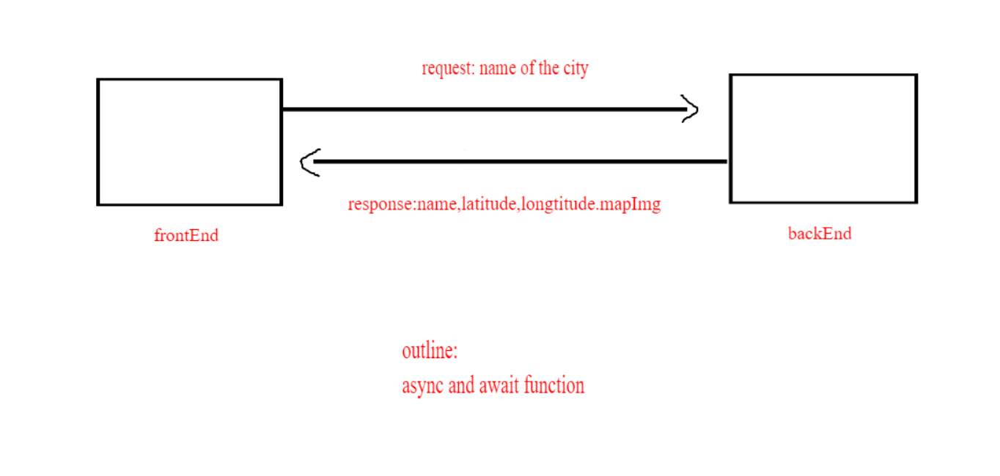

# city-explorer

# Project Name

**Author**: Amani Alnobani
**Version**: 1.0.0 

## Overview
<!-- Provide a high level overview of what this application is and why you are building it, beyond the fact that it's an assignment for this class. (i.e. What's your problem domain?) -->
1. As a user of City Explorer, I want to enter the name of a location so that I can see the exact latitude and longitude of that location.
2. As a user, I want to see a map of the city so that I can see the layout of the area I want to explore.

## Getting Started
<!-- What are the steps that a user must take in order to build this app on their own machine and get it running? -->
1. creat react app
2. instal bootstrap
3. install axios
4. link it to the guthub

## Architecture
1. React library
2. httml,js,css
3. bootstrap

## Change Log

#### 9-5-2021 5:00 pm  Application now has first step done and the function of render the form and call the name of cities done 

## Credit and Collaborations
<!-- Give credit (and a link) to other people or resources that helped you build this application. -->
#### Ahmad Abuteifor helped me build this application.

Name of feature: Process

Estimate of time needed to complete: 15 min

Start time: 2:30pm
Finish time: 2:45pm

Actual time needed to complete: 30 min

# // // // // // // // // // // 

Name of feature: Workflow

Estimate of time needed to complete: 3 hours

Start time: 3pm
Finish time: 5pm

Actual time needed to complete: 4 hours